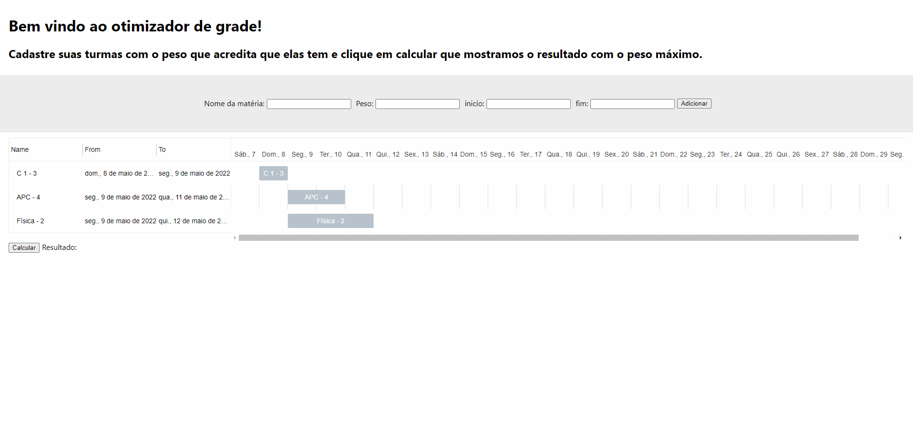
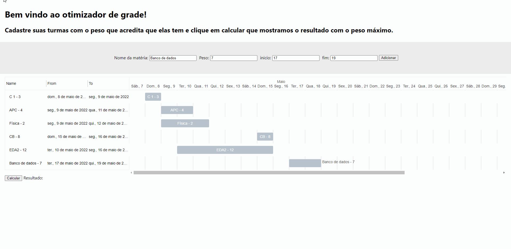
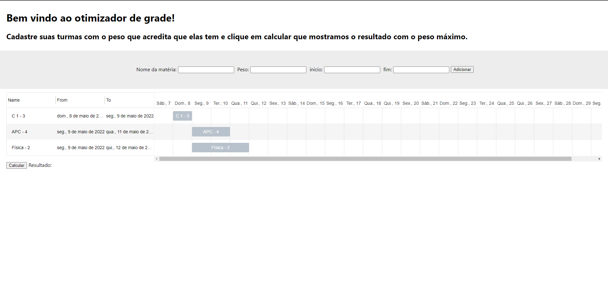
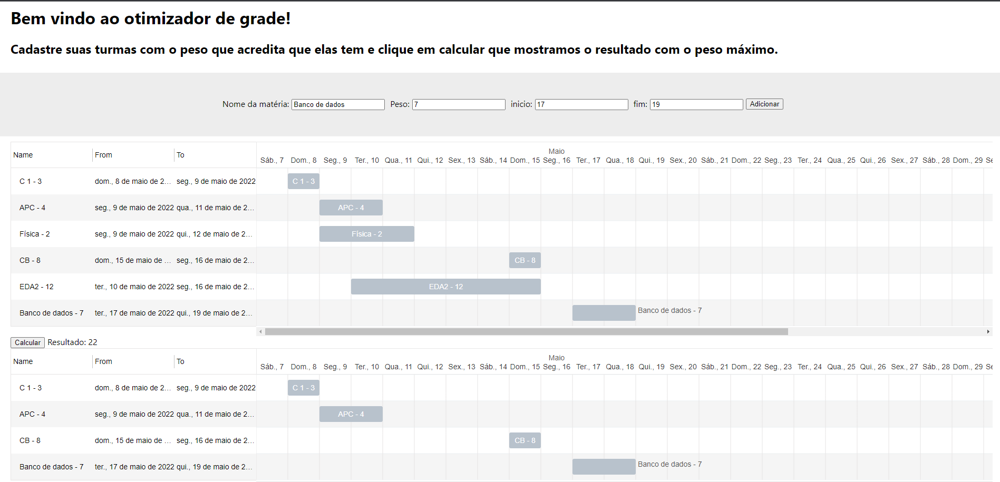

# Otimizador de grade

**Número da Lista**: 5<br>
**Conteúdo da Disciplina**: Programação dinâmica<br>

## Alunos
|Matrícula | Aluno |
| -- | -- |
| 16/0127891 |  João Vitor de Moura Rosa Silva |
| 16/0016169  |  Nícalo Ribeiro |

## Sobre 
O objetivo do projeto, é utilizar o algoritmo de Weighted Interval Scheduling utilizando uma adaptação para lidar com outras tarefas com conflito de horario e salvando as tarefas pegas no resultado final. O contexto aplicado no projeto é o de ajudar um aluno a montar a sua grade da faculdade, dando a ele possibilidade de cadastrar novas opções de matérias e os pesos que ele acredita que elas tem e, por fim, gerar um cronograma com as matérias que ele consegue pegar com máximo de peso.

## Vídeo de apresentação
[Vídeo de apresentacao](utils/ProjetoDeAlgoritmosP-D-Dupla30.mp4)  
Caso o link não funcione, o vídeo está dentro da pasta 'utils' e tem o nome de 'ProjetoDeAlgoritmosP-D-Dupla30'
Link do one drive: [Vídeo de apresentação](https://unbbr-my.sharepoint.com/:v:/r/personal/160127891_aluno_unb_br/Documents/Grava%C3%A7%C3%B5es/Reuni%C3%A3o%20com%20Nicalo%20Ribeiro%20Dourado%20Araujo-20220418_234113-Grava%C3%A7%C3%A3o%20de%20Reuni%C3%A3o.mp4?csf=1&web=1&e=ZqAgPz)
## Screenshots





## Instalação 
**Linguagem**: Javascript<br>
**Framework**: ReactJs<br>
**Requisitos**: npm ou yarn

## Uso 
```
npm install OU yarn install
```

```
npm start OU yarn start
```
